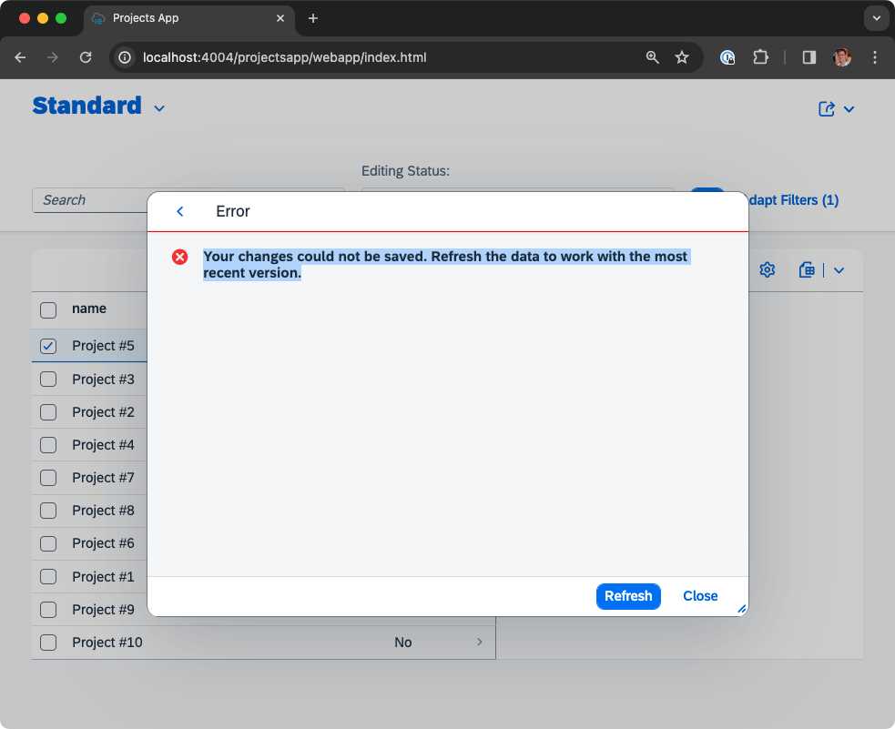
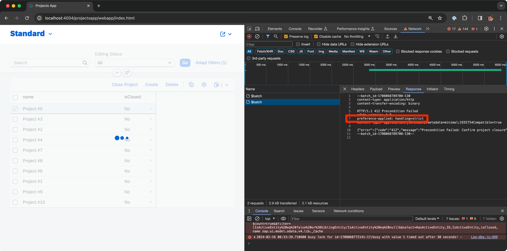

# Example for Confirmation Popup for Actions that Fail with 412 Warnings

> [!CAUTION]
> This example does not work as expected.

The SAPUI5 documentation describes how to achive
[Confirmation Popups](https://ui5.sap.com/#/topic/9a536627a6a94de084b0605eb164d2c8#section_n3z_htm_vsb)
for Save, Activate and Create actions as well as custom actions via HTTP responses with status code 412.

To try out the example run `npm install` and `cds watch`. Open
[the Projects App](http://localhost:4004/projectsapp/webapp/index.html), click on "Go", select a Project and click on
the "Close Project" action.

The expected outcome would be that a warning dialog is shown with the message
"Precondition Failed: Confirm project closure".

Currently an error dialog opens with the message
"Your changes could not be saved. Refresh the data to work with the most recent version."



The Fiori Elements app sends the request

```
POST Projects(ID=05e13cca-7cd6-4398-ad1b-df7e28df849a,IsActiveEntity=true)/ExampleService.closeProject HTTP/1.1
Accept:application/json;odata.metadata=minimal;IEEE754Compatible=true
Accept-Language:en
Prefer:handling=strict
Content-Type:application/json;charset=UTF-8;IEEE754Compatible=true

{}
```

to the CAP application.

The CAP application handles the `Prefer` header in the action handler of [example-service.js](./srv/example-service.js):

```
if (request.headers['prefer'] === 'handling=strict') {
    return request.error(412, 'Precondition Failed: Confirm project closure')
}
```

Adding the response header `Preference-Applied: handling=strict` as mentioned
[here](https://github.com/cap-js/docs/issues/436) leads to the Fiori Elements app staying in "busy" state after the
action has been called.


