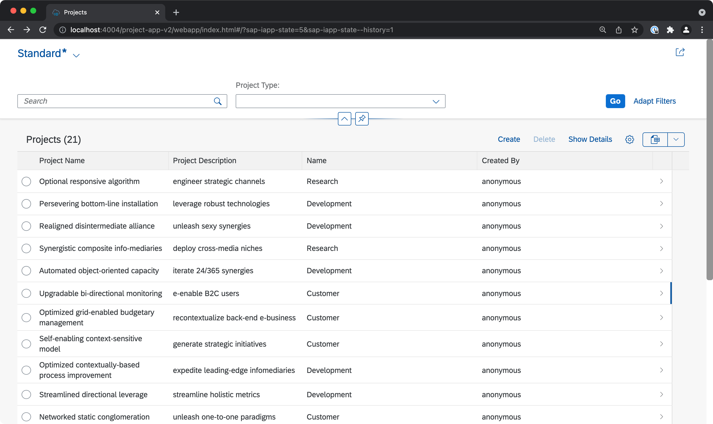
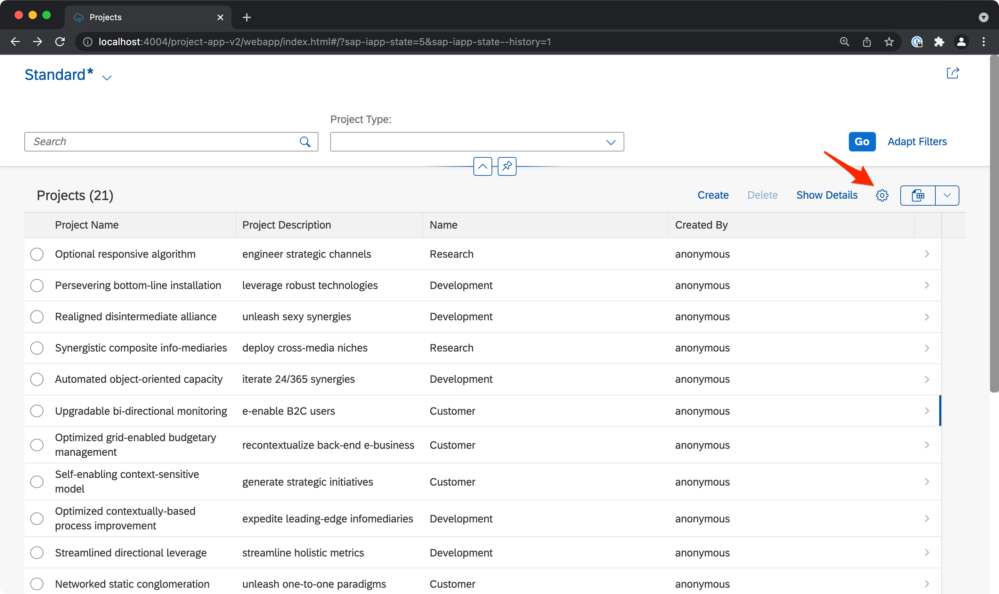
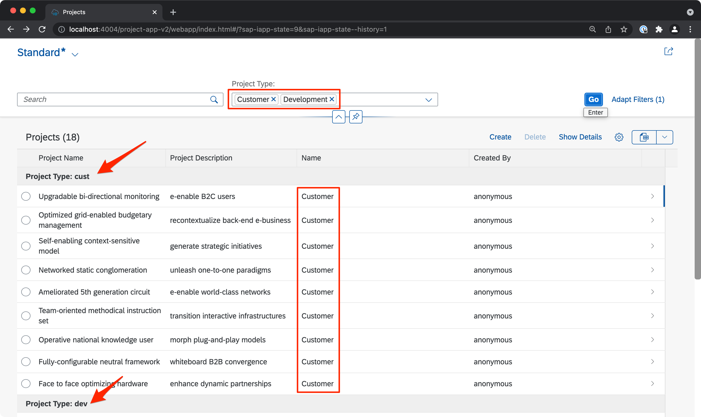
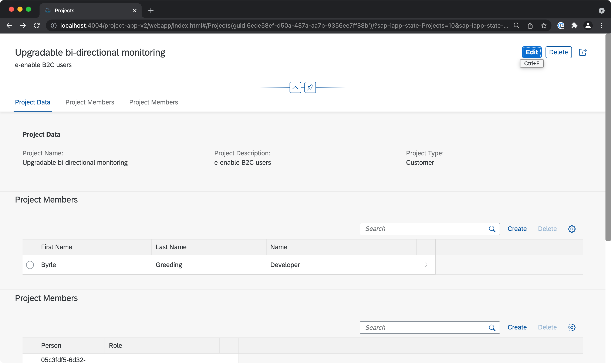
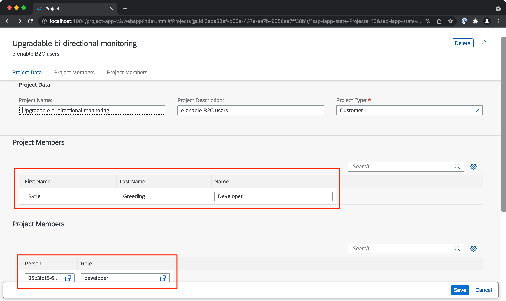
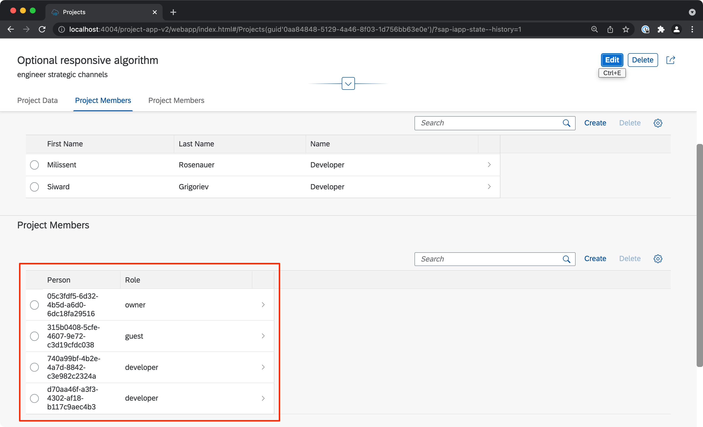
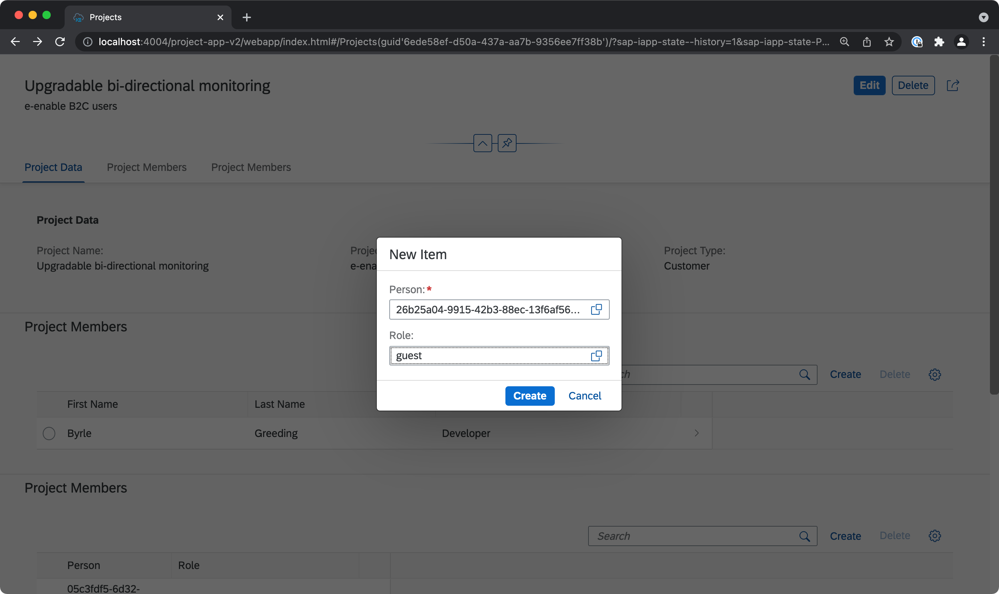
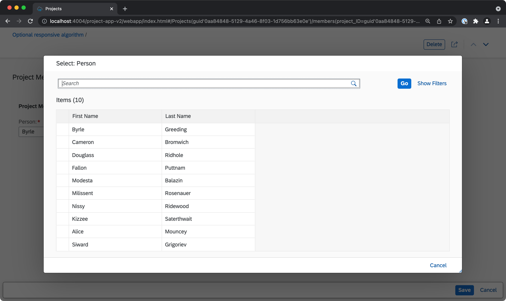
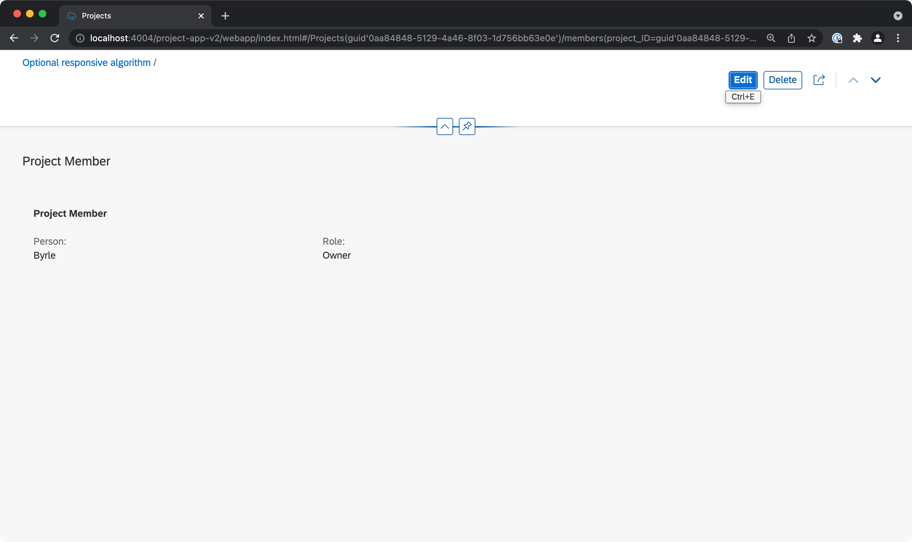

# Issues with Value Helps in CAP and Fiori Elements for OData V2

## #1 List Report - Grouping shows IDs instead of text

When the List Report table is grouped by project type, the code of the ProjectTypes code list is shown instead of the text.

The List Report shows the Project Type (in the Name column) and is displayed as Value Help with fixed values in the filter.

When you customize the table to group by Project Type, and filter on some types ...

... you can see that the Grouping Headings show the Code of the Value Help instead of the Text.

The selected items in the Value Help field in the filter respect the Text Arrangement.

## #2 Object Page - Edit Mode makes table fields editable

When the Object Page is switched into Edit Mode, all tables become editable. The first table is setup
to display the Project Members in a user friendly manner, but edit mode makes no sense, the fields are text input fields and not value helps.

The table fields become editable when the Object Page is put into edit mode. For the upper table this makes no sense, for the lower table it would be ok, but there is issue #3. The Value Help in the first section (Project Type) works as expected.

## #3 Object Page - Value Helps in Tables show IDs instead of texts

The second Project Members table is setup for editability, but the table shows only IDs instead of texts in display and in edit mode.

## #4 Object Page - Table create dialog shows IDs instead of texts

The create dialog of the second Project Members table shows only IDs of the selected value helps but not the texts.

## #5 odata.concat does not work for Common.Text values

It is not possible to use the odata.concat function to combine the first name and last name of the Persons value help on the Project Members Object Page. Showing both fields as a CombinedFields makes no sense, because then the value help does not work anymore.

We would like to show both first and last name, but using odata.concat has no effect. Only selecting on field as Common.Text Value works.

## Version Information
- @sap/cds: 5.6.4
- @sap/cds-compiler: 2.10.4
- @sap/cds-dk: 4.6.4
- @sap/cds-foss: 3.0.0
- @sap/eslint-plugin-cds: 2.2.2
- Node.js: v14.18.0